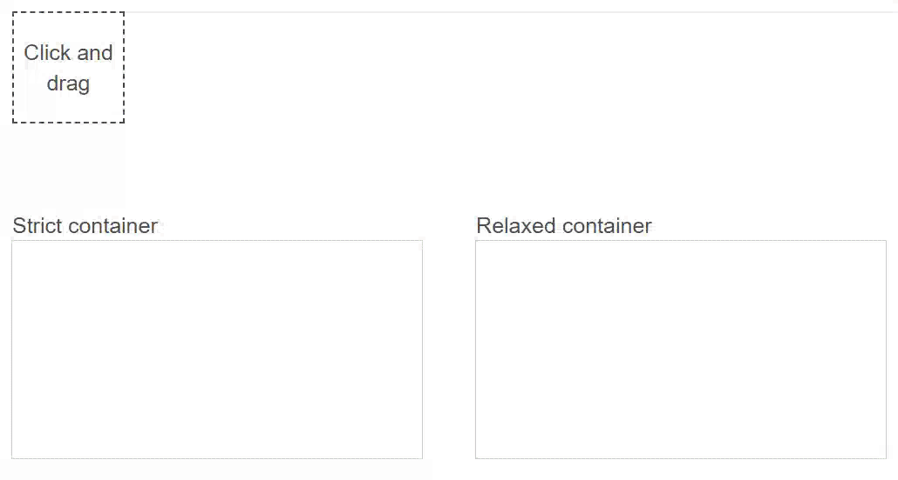

# Drag'n'Drop

Домашнее задание для "Школы программистов HeadHunter" (DOM/AJAX/Browser API)

## Ссылка на GitHub Pages 🎨

[Ссылка]( https://nikita160.github.io/DOM-AJAX-API-homework/)
                                           

## Демо

## Функциональность

-   генерируется новый элемент
-   drag'n'drop-ом его можно перенести в одну из двух областей
-   в одной из областей элементы встают в порядке добавления по сетке, один за другим
-   в второй области элемент остаётся на месте drop-a, при этом если один из элементов не попал при drop-e полностью в область, то появляется скролл как вниз, так и вверх. Новые добавляемые элементы позиционируются с учетом текущего скролла

## Стек

-   HTML/CSS
-   JavaScript
-   Events

## Исходное задание

1. Зона создающая новый элемент при перетаскивании.

2. Элемент — квадрат 100х100px случайного цвета

3. Область при перетаскивании в которую элементы располагаются в соответствии с сеткой

4. Область сохраняющая положение перемещенного в неё элемента

5. Если элемент опущен мимо вышеописанных областей — он исчезает
